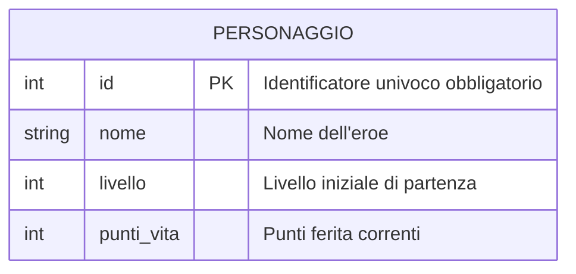
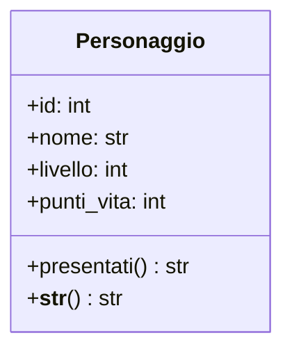

# Design Esercizio 01: Modellazione Entità Personaggio (Soluzione di Riferimento)

## 1. Modello ER (Tabella su Disco)

```mermaid
erDiagram
    PERSONAGGIO {
        int id PK "Identificatore univoco obbligatorio"
        string nome "Nome dell'eroe"
        int livello "Livello iniziale di partenza"
        int punti_vita "Punti ferita correnti"
    }
```

---

## 2. Diagramma delle Classi UML (Oggetto in RAM)

```mermaid
classDiagram
    class Personaggio {
        +id: int
        +nome: str
        +livello: int
        +punti_vita: int
        +presentati() str
        +__str__() str
    }
```