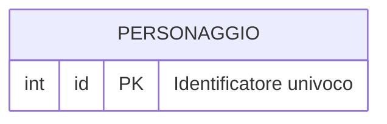
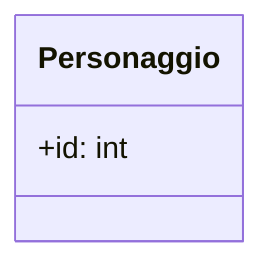

# Design Esercizio 01: Modellazione Entità Personaggio

## 1. Modello ER (Tabella su Disco)

<!-- 
Completa il diagramma Mermaid erDiagram definendo l'entità PERSONAGGIO.
Assicurati di indicare la Primary Key con 'PK' e i tipi relazionali corretti.
-->

---

## 2. Diagramma delle Classi UML (Oggetto in RAM)

<!-- 
Completa il diagramma Mermaid classDiagram definendo la classe Personaggio.
Usa '+' per la visibilità pubblica, i tipi Python (int, str) e le firme dei metodi.
-->

