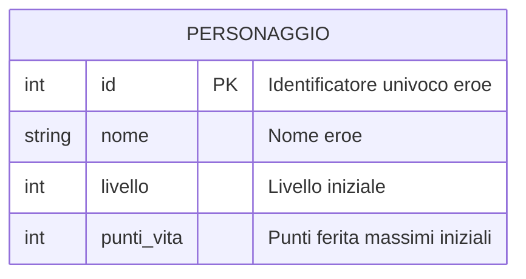
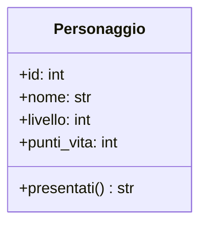

# Design Esercizio 02: Mappatura Tipi e Dataclass (Soluzione di Riferimento)

## 1. Modello ER (Database su Disco)

```mermaid
erDiagram
    PERSONAGGIO {
        int id PK "Identificatore univoco eroe"
        string nome "Nome eroe"
        int livello "Livello iniziale"
        int punti_vita "Punti ferita massimi iniziali"
    }
```

---

## 2. Diagramma delle Classi UML (RAM)

```mermaid
classDiagram
    class Personaggio {
        +id: int
        +nome: str
        +livello: int
        +punti_vita: int
        +presentati() str
    }
```
