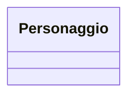

# Design Esercizio 02: Mappatura Tipi e Dataclass

## 1. Modello ER (Database su Disco)

<!-- 
Disegna il diagramma Mermaid erDiagram per l'entità PERSONAGGIO.
Indica id come PK e usa i tipi relazionali (string, int).
-->

---

## 2. Diagramma delle Classi UML (RAM)

<!-- 
Disegna il diagramma Mermaid classDiagram per la classe Personaggio.
Usa i tipi Python (int, str) e la visibilità pubblica (+).
-->

