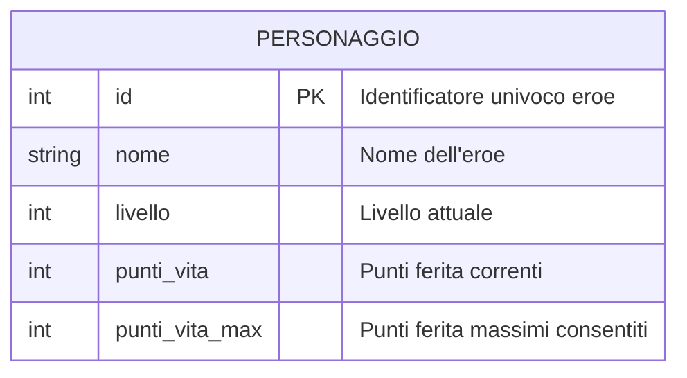
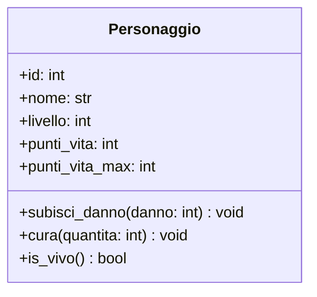

# Design Esercizio 03: Metodi di Stato e Invarianti (Soluzione di Riferimento)

## 1. Modello ER (Database su Disco)

```mermaid
erDiagram
    PERSONAGGIO {
        int id PK "Identificatore univoco eroe"
        string nome "Nome dell'eroe"
        int livello "Livello attuale"
        int punti_vita "Punti ferita correnti"
        int punti_vita_max "Punti ferita massimi consentiti"
    }
```

---

## 2. Diagramma delle Classi UML (RAM)

```mermaid
classDiagram
    class Personaggio {
        +id: int
        +nome: str
        +livello: int
        +punti_vita: int
        +punti_vita_max: int
        +subisci_danno(danno: int) void
        +cura(quantita: int) void
        +is_vivo() bool
    }
```
