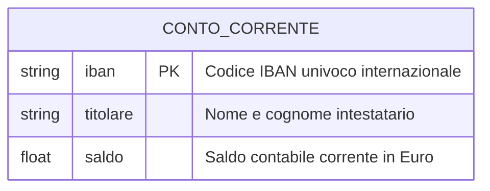
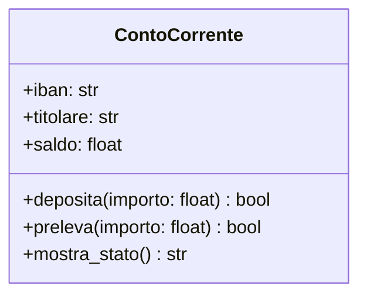

# Design Esercizio 04: Dominio Bancario (Soluzione di Riferimento)

## 1. Modello ER (Database su Disco)

```mermaid
erDiagram
    CONTO_CORRENTE {
        string iban PK "Codice IBAN univoco internazionale"
        string titolare "Nome e cognome intestatario"
        float saldo "Saldo contabile corrente in Euro"
    }
```

---

## 2. Diagramma delle Classi UML (RAM)

```mermaid
classDiagram
    class ContoCorrente {
        +iban: str
        +titolare: str
        +saldo: float
        +deposita(importo: float) bool
        +preleva(importo: float) bool
        +mostra_stato() str
    }
```
