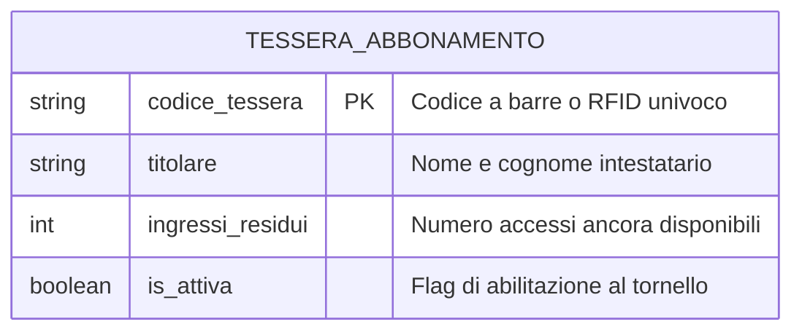
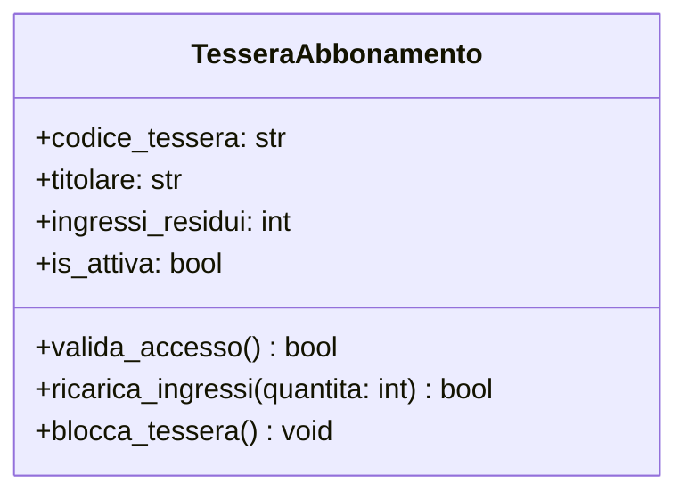

# Design Esercizio 05: Dominio Ticketing (Soluzione di Riferimento)

## 1. Modello ER (Database su Disco)

```mermaid
erDiagram
    TESSERA_ABBONAMENTO {
        string codice_tessera PK "Codice a barre o RFID univoco"
        string titolare "Nome e cognome intestatario"
        int ingressi_residui "Numero accessi ancora disponibili"
        boolean is_attiva "Flag di abilitazione al tornello"
    }
```

---

## 2. Diagramma delle Classi UML (RAM)

```mermaid
classDiagram
    class TesseraAbbonamento {
        +codice_tessera: str
        +titolare: str
        +ingressi_residui: int
        +is_attiva: bool
        +valida_accesso() bool
        +ricarica_ingressi(quantita: int) bool
        +blocca_tessera() void
    }
```
