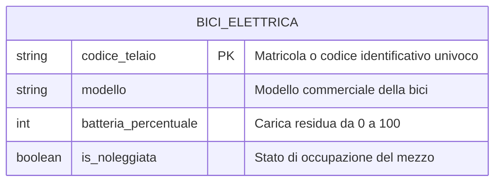
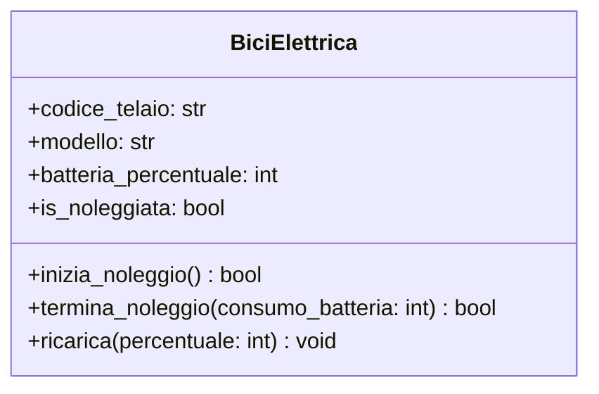

# Design Esercizio 07: Pipeline Completa Bici Elettrica (Soluzione di Riferimento)

## 1. Requisiti e User Story

**Come** Utente del servizio di bike sharing  
**voglio** noleggiare una bicicletta elettrica disponibile e carica  
**per** spostarmi rapidamente in città in modo ecologico ed economico  

### Criteri di Accettazione (Definition of Done)
- [ ] Ogni mezzo è identificato da una Primary Key univoca `codice_telaio`.
- [ ] Un noleggio può iniziare solo se la bicicletta non è già in uso (`is_noleggiata == False`) E la batteria è almeno al 20% (`batteria_percentuale >= 20`).
- [ ] All'inizio del noleggio, il mezzo passa allo stato `is_noleggiata = True`.
- [ ] Al termine del noleggio, la bici torna disponibile (`is_noleggiata = False`) e la batteria viene decurtata del consumo effettivo garantendo che non scenda sotto 0%.
- [ ] La ricarica aumenta la carica residua senza mai superare la soglia massima del 100%.

---

## 2. Modello ER (Database su Disco)

---

## 3. Diagramma delle Classi UML (RAM)

