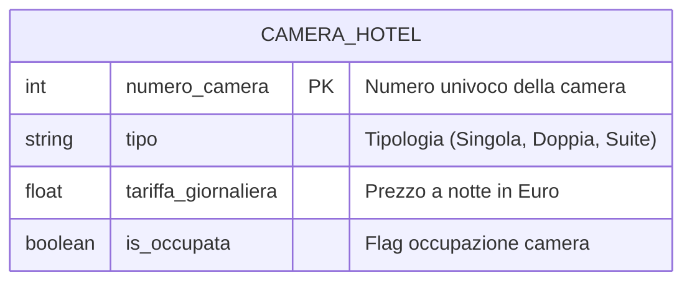
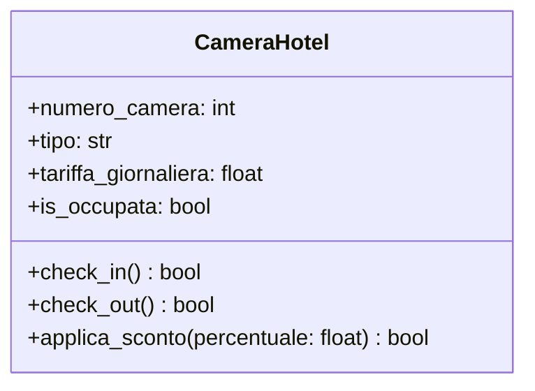

# Design Esercizio 08: Detective di Classe (Soluzione di Riferimento)

## 1. Il Verdetto del Detective

- **Difetto 1 (Modello ER):** Nella tabella `CAMERA_HOTEL` manca la clausola `PK` su `numero_camera`. Senza Primary Key il database non garantisce l'unicità dei numeri di stanza, permettendo stanze duplicate.
- **Difetto 2 (Diagramma UML):** Il metodo `check_in()` è stato dichiarato con visibilità privata (`-`) e senza valore di ritorno (`void`). Deve essere pubblico (`+`) e restituire `bool` per notificare alla reception se l'assegnazione è riuscita.
- **Difetto 3 (Codice Python e Invarianti):**
  - `check_in()` non controlla se la camera è già occupata prima di impostare `True`, sovrascrivendo la prenotazione esistente.
  - `check_out()` non verifica se la stanza era effettivamente occupata, restituendo `True` anche su stanze già vuote.
  - `applica_sconto()` non rispetta la policy aziendale del tetto massimo al 50%, permettendo sconti esagerati (anche del 100% o negativi).

---

## 2. I Modelli Corretti (Mermaid)

### Diagramma ER Corretto

### Class Diagram UML Corretto

