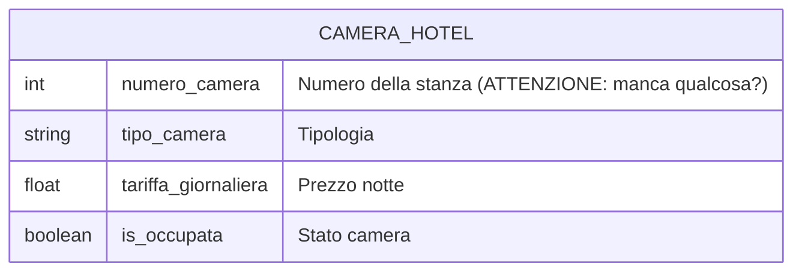
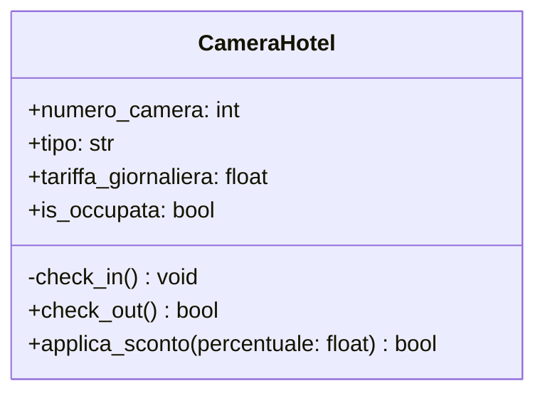

# Design Esercizio 08: Detective di Classe (Camera Hotel)

## 1. I Modelli Difettosi del Collega (Da Analizzare)





---

## 2. Il Verdetto del Detective

<!-- 
Identifica e spiega i 3 difetti presenti nel lavoro del collega:
1. Errore nel modello ER.
2. Errore nel Class Diagram UML.
3. Bug logico nel codice Python.
-->

- [ ] **Difetto 1 (Modello ER):** [...]
- [ ] **Difetto 2 (Diagramma UML):** [...]
- [ ] **Difetto 3 (Codice Python e Invarianti):** [...]

---

## 3. I Modelli Corretti (Mermaid)

### Diagramma ER Corretto
```mermaid
erDiagram
    %% Disegna qui il diagramma ER corretto con la PK obbligatoria
```

### Class Diagram UML Corretto
```mermaid
classDiagram
    %% Disegna qui il diagramma UML con visibilita e firme corrette
```
