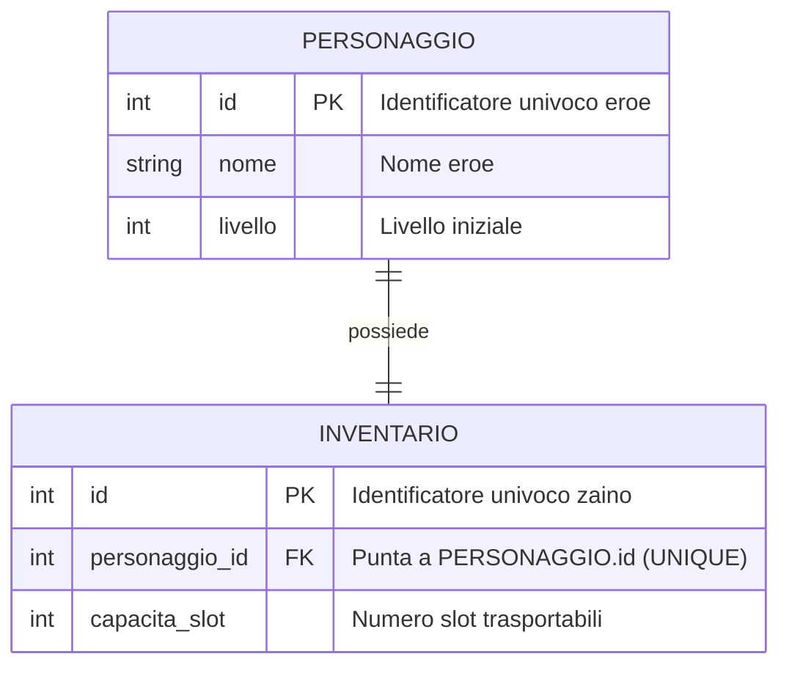
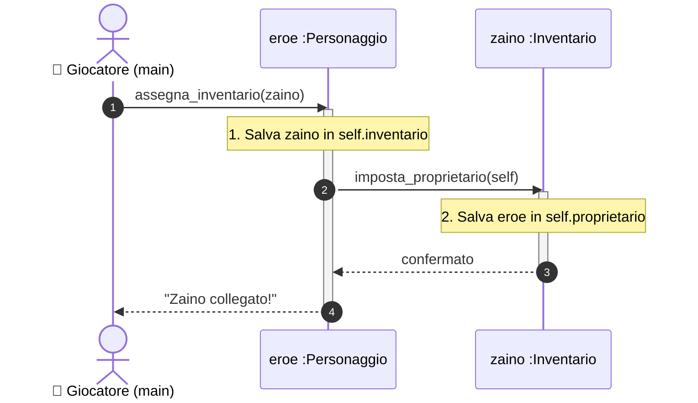
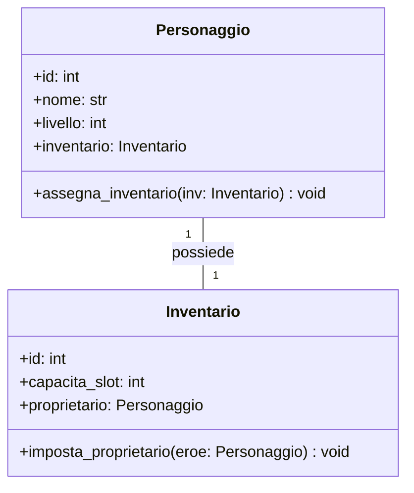

# Design Esercizio 01: Relazione 1-a-1 (Soluzione di Riferimento)

## 1. Modello ER (Database su Disco)

```mermaid
erDiagram
    PERSONAGGIO ||--|| INVENTARIO : possiede

    PERSONAGGIO {
        int id PK "Identificatore univoco eroe"
        string nome "Nome eroe"
        int livello "Livello iniziale"
    }
    INVENTARIO {
        int id PK "Identificatore univoco zaino"
        int personaggio_id FK "Punta a PERSONAGGIO.id (UNIQUE)"
        int capacita_slot "Numero slot trasportabili"
    }
```

---

## 2. Diagramma di Sequenza (Dinamica)

```mermaid
sequenceDiagram
    autonumber
    actor Giocatore as 👤 Giocatore (main)
    participant Eroe as eroe :Personaggio
    participant Zaino as zaino :Inventario

    Giocatore->>Eroe: assegna_inventario(zaino)
    activate Eroe
    Note over Eroe: 1. Salva zaino in self.inventario
    Eroe->>Zaino: imposta_proprietario(self)
    activate Zaino
    Note over Zaino: 2. Salva eroe in self.proprietario
    Zaino-->>Eroe: confermato
    deactivate Zaino
    Eroe-->>Giocatore: "Zaino collegato!"
    deactivate Eroe
```

---

## 3. Diagramma delle Classi UML (RAM)

```mermaid
classDiagram
    Personaggio "1" -- "1" Inventario : possiede

    class Personaggio {
        +id: int
        +nome: str
        +livello: int
        +inventario: Inventario
        +assegna_inventario(inv: Inventario) void
    }

    class Inventario {
        +id: int
        +capacita_slot: int
        +proprietario: Personaggio
        +imposta_proprietario(eroe: Personaggio) void
    }
```
