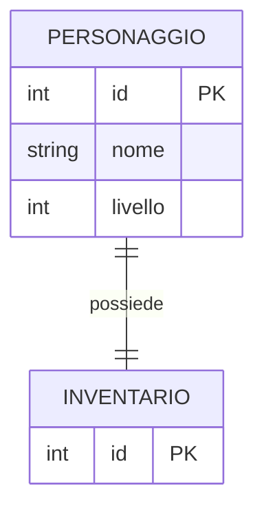
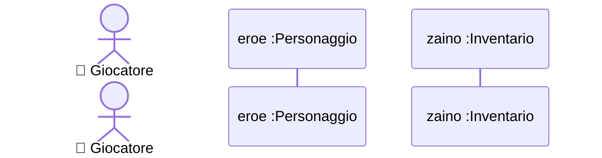

# Design Esercizio 01: Relazione 1-a-1 (Eroe e Zaino)

## 1. Modello ER (Database su Disco)



---

## 2. Diagramma di Sequenza (Dinamica)



---

## 3. Diagramma delle Classi UML (RAM)

```mermaid
classDiagram
    %% Disegna qui le classi Personaggio e Inventario con la relazione "1" -- "1"
```
