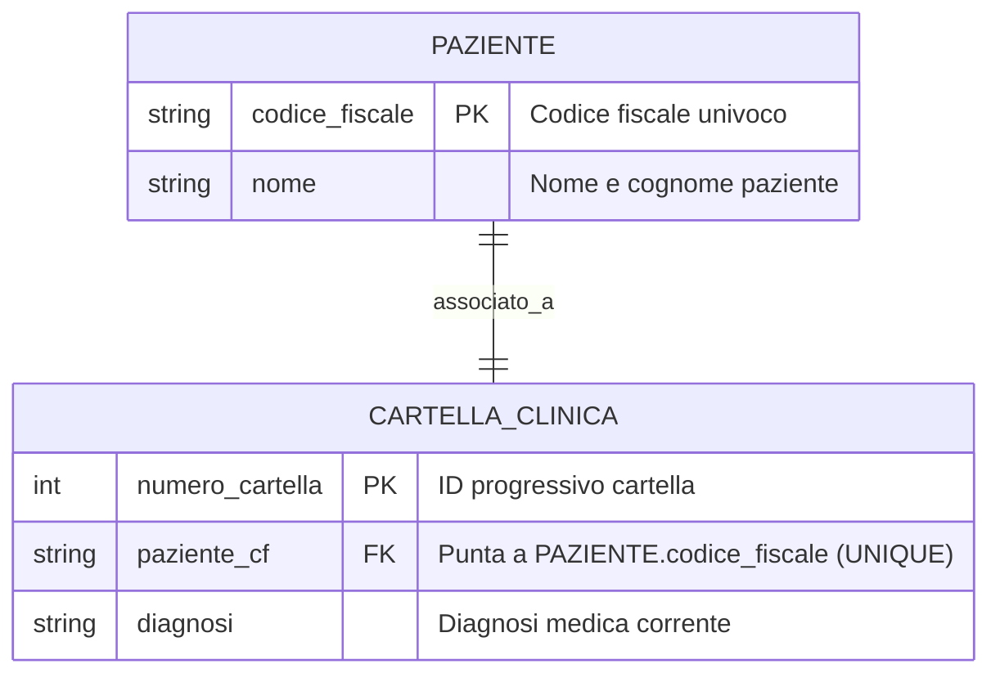
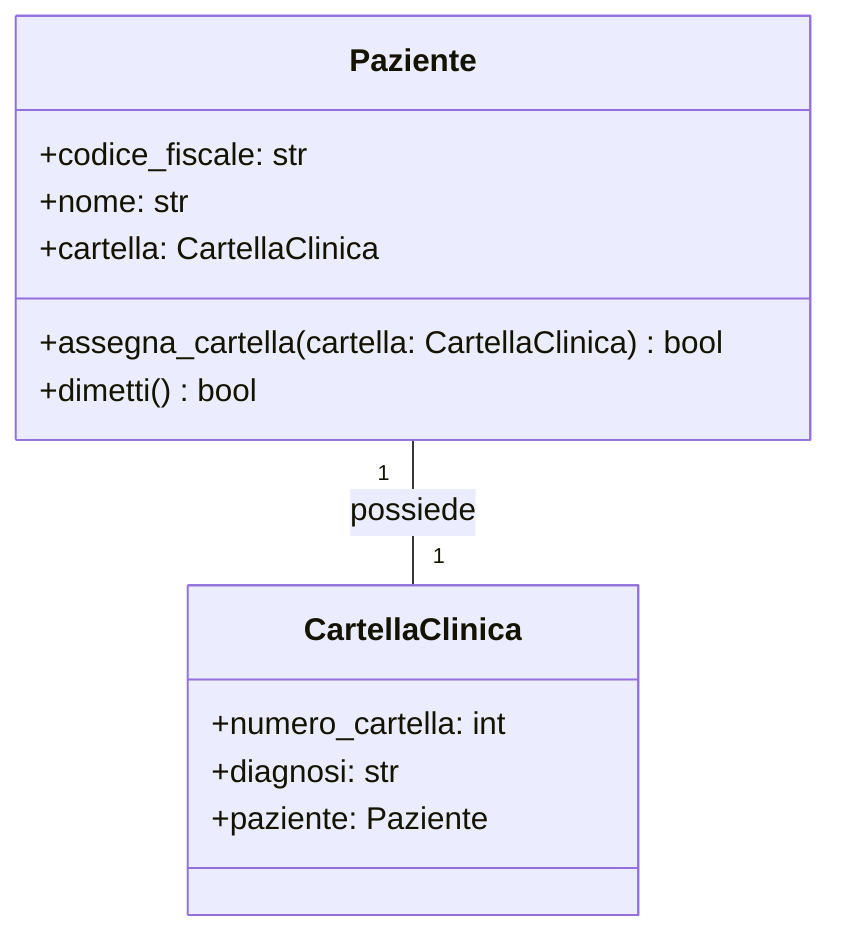

# Design Esercizio 02: Paziente e Cartella Clinica (Soluzione di Riferimento)

## 1. Modello ER

```mermaid
erDiagram
    PAZIENTE ||--|| CARTELLA_CLINICA : associato_a

    PAZIENTE {
        string codice_fiscale PK "Codice fiscale univoco"
        string nome "Nome e cognome paziente"
    }
    CARTELLA_CLINICA {
        int numero_cartella PK "ID progressivo cartella"
        string paziente_cf FK "Punta a PAZIENTE.codice_fiscale (UNIQUE)"
        string diagnosi "Diagnosi medica corrente"
    }
```

---

## 2. Diagramma delle Classi UML

```mermaid
classDiagram
    Paziente "1" -- "1" CartellaClinica : possiede

    class Paziente {
        +codice_fiscale: str
        +nome: str
        +cartella: CartellaClinica
        +assegna_cartella(cartella: CartellaClinica) bool
        +dimetti() bool
    }

    class CartellaClinica {
        +numero_cartella: int
        +diagnosi: str
        +paziente: Paziente
    }
```
