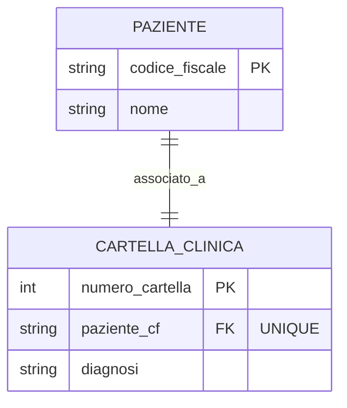

# Design Esercizio 02: Paziente e Cartella Clinica (1:1)

## 1. Modello ER (Database su Disco)



---

## 2. Diagramma delle Classi UML (RAM)

```mermaid
classDiagram
    %% Disegna qui Paziente e CartellaClinica con i metodi assegna_cartella e dimetti
```
