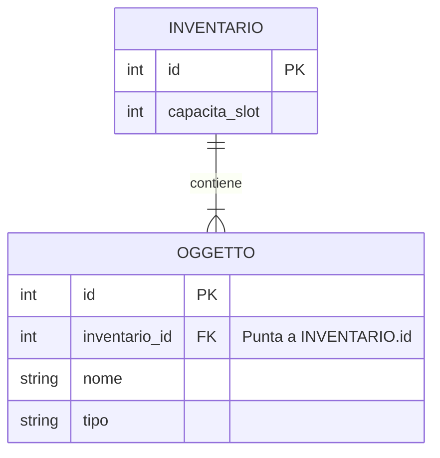
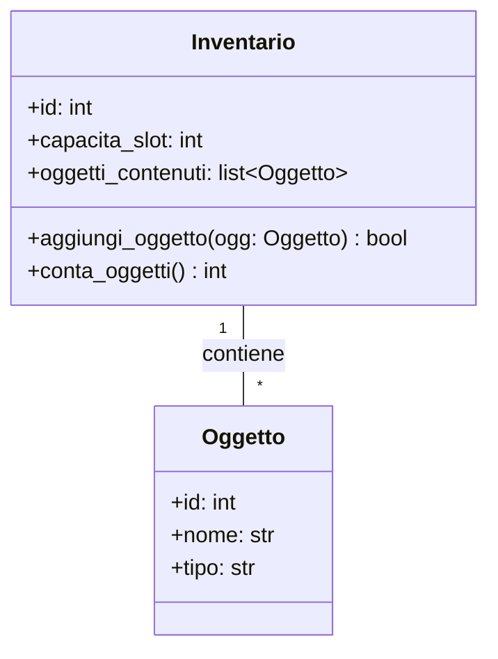

# Design Esercizio 03: Relazione 1-a-Molti (Zaino e Oggetti)

## 1. Modello ER (Database su Disco)

```mermaid
erDiagram
    INVENTARIO ||--|{ OGGETTO : contiene

    INVENTARIO {
        int id PK
        int capacita_slot
    }
    OGGETTO {
        int id PK
        int inventario_id FK "Punta a INVENTARIO.id"
        string nome
        string tipo
    }
```

---

## 2. Diagramma delle Classi UML (RAM)

```mermaid
classDiagram
    Inventario "1" -- "*" Oggetto : contiene

    class Inventario {
        +id: int
        +capacita_slot: int
        +oggetti_contenuti: list~Oggetto~
        +aggiungi_oggetto(ogg: Oggetto) bool
        +conta_oggetti() int
    }

    class Oggetto {
        +id: int
        +nome: str
        +tipo: str
    }
```
