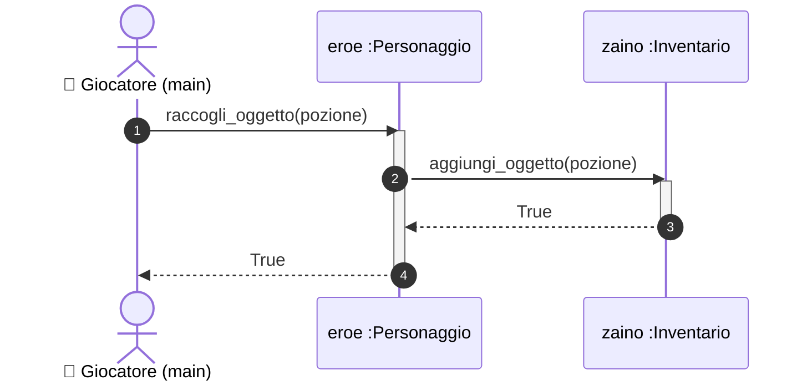

# Design Esercizio 04: Principio di Delega (Soluzione di Riferimento)

```mermaid
sequenceDiagram
    autonumber
    actor Giocatore as 👤 Giocatore (main)
    participant Eroe as eroe :Personaggio
    participant Zaino as zaino :Inventario

    Giocatore->>Eroe: raccogli_oggetto(pozione)
    activate Eroe
    Eroe->>Zaino: aggiungi_oggetto(pozione)
    activate Zaino
    Zaino-->>Eroe: True
    deactivate Zaino
    Eroe-->>Giocatore: True
    deactivate Eroe
```
