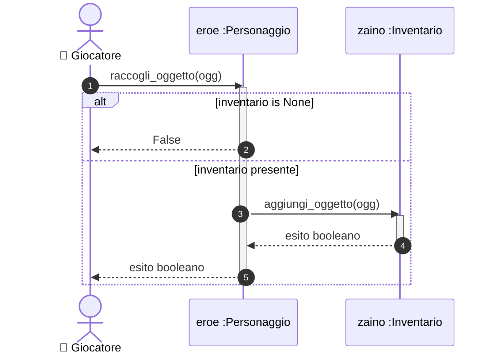

# Design Esercizio 04: Principio di Delega

## Diagramma di Sequenza (Delega Raccolta)

```mermaid
sequenceDiagram
    autonumber
    actor Giocatore as 👤 Giocatore
    participant Eroe as eroe :Personaggio
    participant Zaino as zaino :Inventario

    Giocatore->>Eroe: raccogli_oggetto(ogg)
    activate Eroe
    alt inventario is None
        Eroe-->>Giocatore: False
    else inventario presente
        Eroe->>Zaino: aggiungi_oggetto(ogg)
        activate Zaino
        Zaino-->>Eroe: esito booleano
        deactivate Zaino
        Eroe-->>Giocatore: esito booleano
    end
    deactivate Eroe
```
