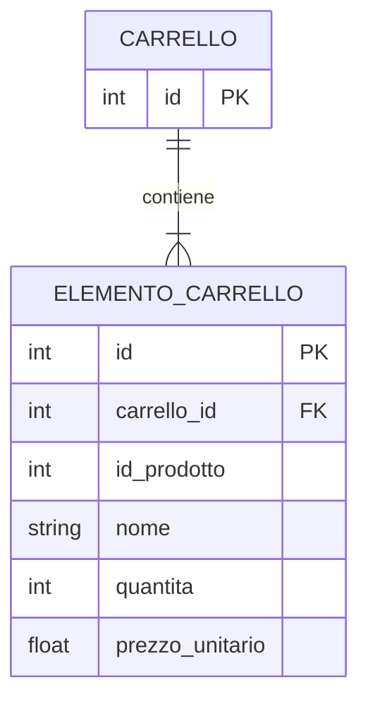

# Design Esercizio 05: Carrello ed Elementi (Soluzione di Riferimento)

```mermaid
erDiagram
    CARRELLO ||--|{ ELEMENTO_CARRELLO : contiene

    CARRELLO {
        int id PK
    }
    ELEMENTO_CARRELLO {
        int id PK
        int carrello_id FK
        int id_prodotto
        string nome
        int quantita
        float prezzo_unitario
    }
```
