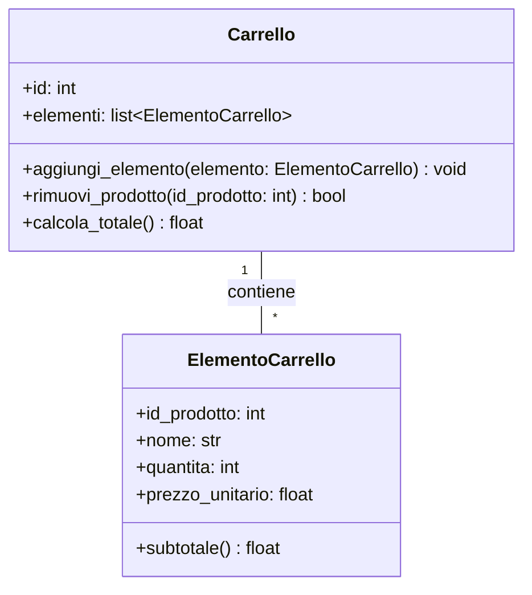

# Design Esercizio 05: Carrello ed Elementi (1:N)

```mermaid
classDiagram
    Carrello "1" -- "*" ElementoCarrello : contiene

    class Carrello {
        +id: int
        +elementi: list~ElementoCarrello~
        +aggiungi_elemento(elemento: ElementoCarrello) void
        +rimuovi_prodotto(id_prodotto: int) bool
        +calcola_totale() float
    }

    class ElementoCarrello {
        +id_prodotto: int
        +nome: str
        +quantita: int
        +prezzo_unitario: float
        +subtotale() float
    }
```
