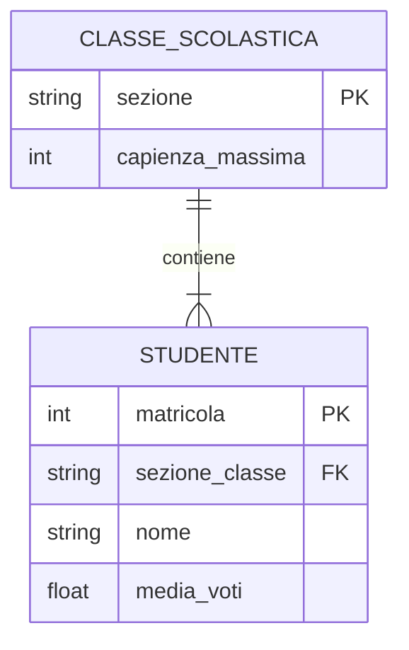

# Design Esercizio 06: Classe e Studenti (Soluzione di Riferimento)

```mermaid
erDiagram
    CLASSE_SCOLASTICA ||--|{ STUDENTE : contiene

    CLASSE_SCOLASTICA {
        string sezione PK
        int capienza_massima
    }
    STUDENTE {
        int matricola PK
        string sezione_classe FK
        string nome
        float media_voti
    }
```
