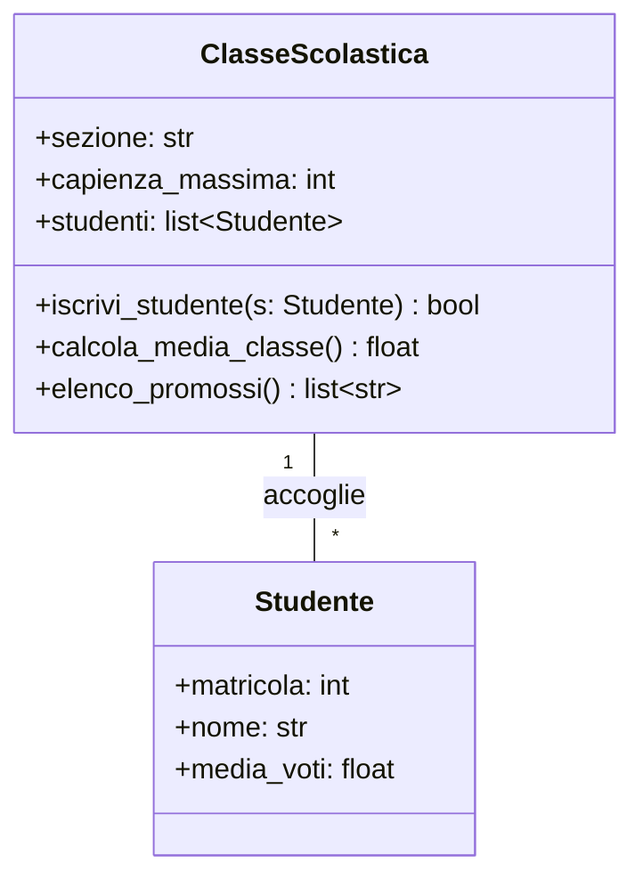

# Design Esercizio 06: Classe e Studenti (1:N)

```mermaid
classDiagram
    ClasseScolastica "1" -- "*" Studente : accoglie

    class ClasseScolastica {
        +sezione: str
        +capienza_massima: int
        +studenti: list~Studente~
        +iscrivi_studente(s: Studente) bool
        +calcola_media_classe() float
        +elenco_promossi() list~str~
    }

    class Studente {
        +matricola: int
        +nome: str
        +media_voti: float
    }
```
