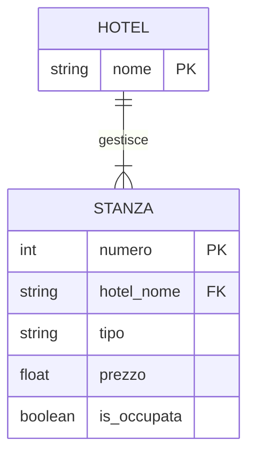
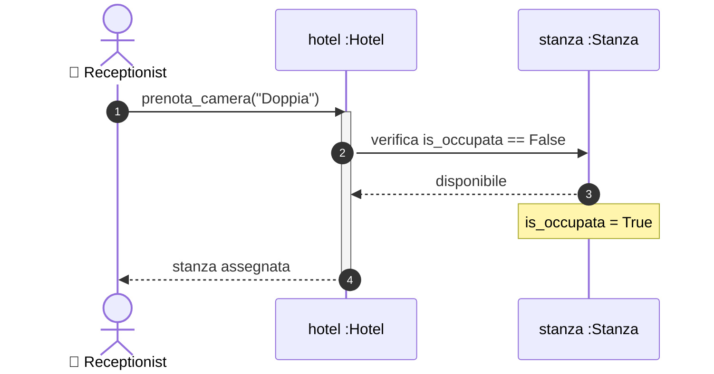

# Design Esercizio 07: Pipeline Completa Hotel e Stanze (Soluzione di Riferimento)

## 1. Requisiti e User Story

**Come** Receptionist dell'albergo  
**voglio** assegnare una camera libera della tipologia richiesta a un cliente  
**per** registrarne il soggiorno garantendo che nessuna stanza venga prenotata due volte  

### Criteri di Accettazione
- [ ] Nel modello ER la Foreign Key `hotel_nome FK` è posizionata nella tabella `STANZA` (lato Molti).
- [ ] L'hotel cerca la prima camera disponibile con `tipo == tipo_richiesto` e `is_occupata == False`.
- [ ] Se disponibile, la camera passa a `is_occupata = True` e viene restituita.
- [ ] Se non ci sono camere libere del tipo richiesto, l'operazione restituisce `None`.

---

## 2. Modello ER

---

## 3. Diagramma di Sequenza

