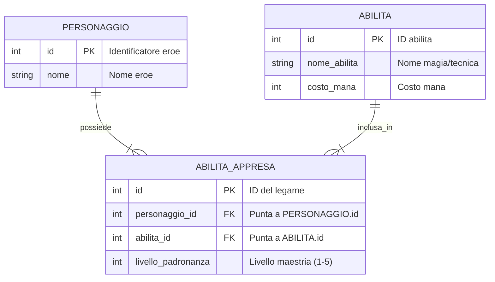

# Design Esercizio 01: Relazione N:N (Soluzione di Riferimento)

```mermaid
erDiagram
    PERSONAGGIO ||--|{ ABILITA_APPRESA : possiede
    ABILITA ||--|{ ABILITA_APPRESA : inclusa_in

    PERSONAGGIO {
        int id PK "Identificatore eroe"
        string nome "Nome eroe"
    }
    ABILITA_APPRESA {
        int id PK "ID del legame"
        int personaggio_id FK "Punta a PERSONAGGIO.id"
        int abilita_id FK "Punta a ABILITA.id"
        int livello_padronanza "Livello maestria (1-5)"
    }
    ABILITA {
        int id PK "ID abilita"
        string nome_abilita "Nome magia/tecnica"
        int costo_mana "Costo mana"
    }
```
