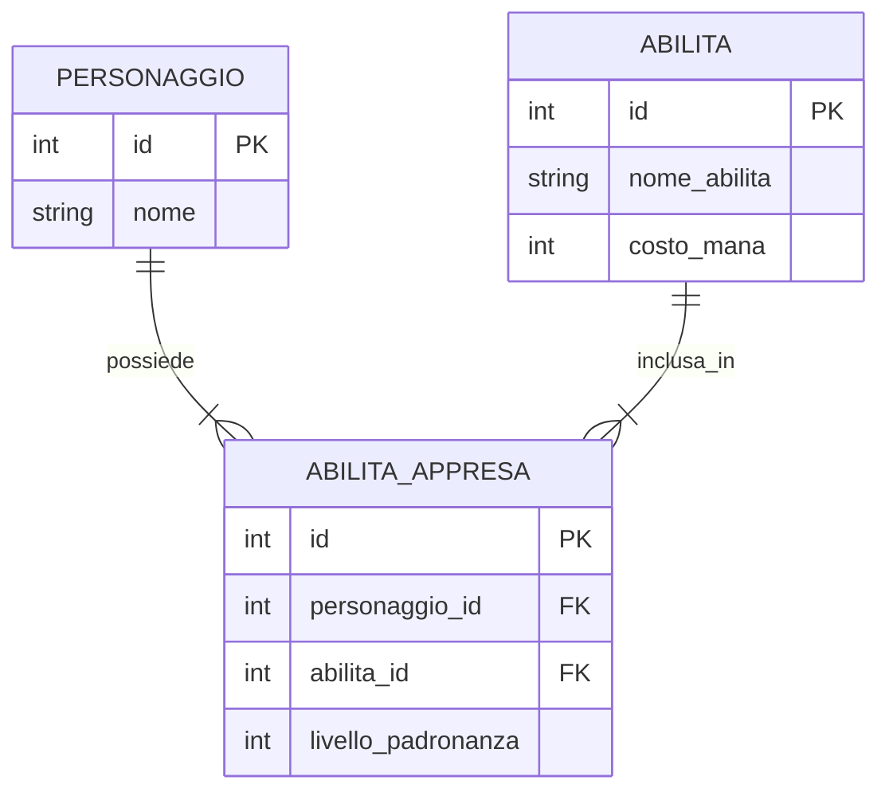
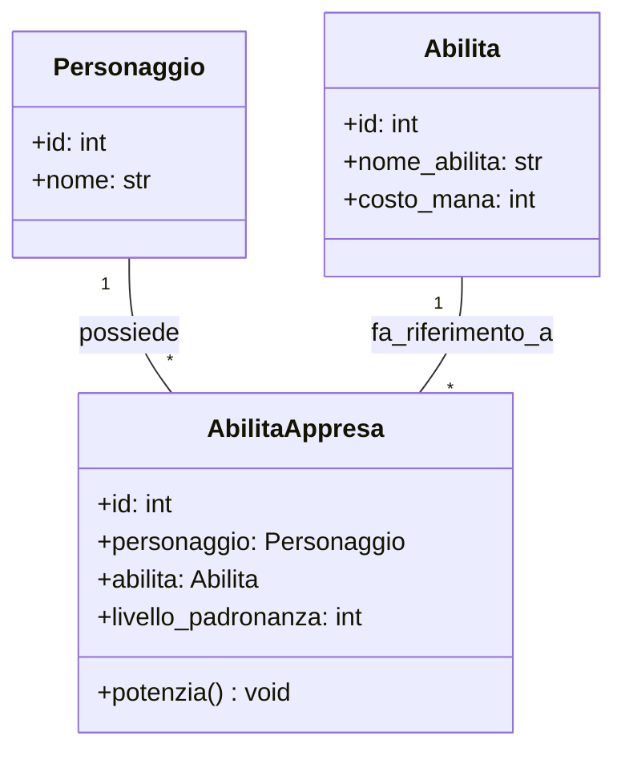

# Design Esercizio 01: Relazione N:N con Entità di Raccordo

## 1. Modello ER (Database su Disco)

```mermaid
erDiagram
    PERSONAGGIO ||--|{ ABILITA_APPRESA : possiede
    ABILITA ||--|{ ABILITA_APPRESA : inclusa_in

    PERSONAGGIO {
        int id PK
        string nome
    }
    ABILITA_APPRESA {
        int id PK
        int personaggio_id FK
        int abilita_id FK
        int livello_padronanza
    }
    ABILITA {
        int id PK
        string nome_abilita
        int costo_mana
    }
```

---

## 2. Diagramma delle Classi UML (RAM)

```mermaid
classDiagram
    Personaggio "1" -- "*" AbilitaAppresa : possiede
    Abilita "1" -- "*" AbilitaAppresa : fa_riferimento_a

    class Personaggio {
        +id: int
        +nome: str
    }

    class AbilitaAppresa {
        +id: int
        +personaggio: Personaggio
        +abilita: Abilita
        +livello_padronanza: int
        +potenzia() void
    }

    class Abilita {
        +id: int
        +nome_abilita: str
        +costo_mana: int
    }
```
