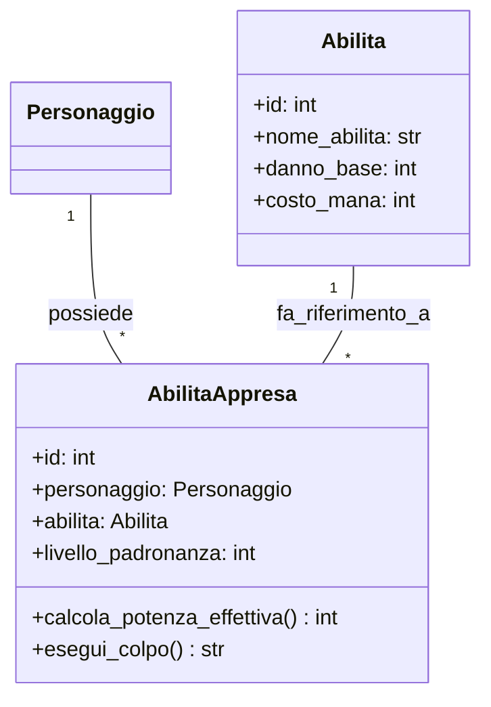

# Design Esercizio 02: Logica di Business su Entità di Raccordo

```mermaid
classDiagram
    Personaggio "1" -- "*" AbilitaAppresa : possiede
    Abilita "1" -- "*" AbilitaAppresa : fa_riferimento_a

    class AbilitaAppresa {
        +id: int
        +personaggio: Personaggio
        +abilita: Abilita
        +livello_padronanza: int
        +calcola_potenza_effettiva() int
        +esegui_colpo() str
    }

    class Abilita {
        +id: int
        +nome_abilita: str
        +danno_base: int
        +costo_mana: int
    }
```
