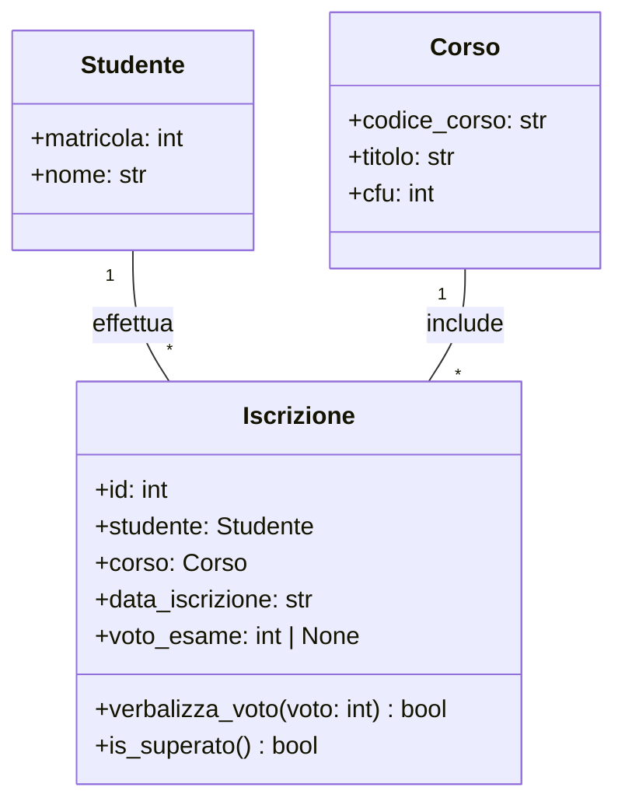

# Design Esercizio 03 (Soluzione di Riferimento)

```mermaid
classDiagram
    Studente "1" -- "*" Iscrizione : effettua
    Corso "1" -- "*" Iscrizione : include

    class Iscrizione {
        +id: int
        +studente: Studente
        +corso: Corso
        +data_iscrizione: str
        +voto_esame: int | None
        +verbalizza_voto(voto: int) bool
        +is_superato() bool
    }

    class Studente {
        +matricola: int
        +nome: str
    }

    class Corso {
        +codice_corso: str
        +titolo: str
        +cfu: int
    }
```
