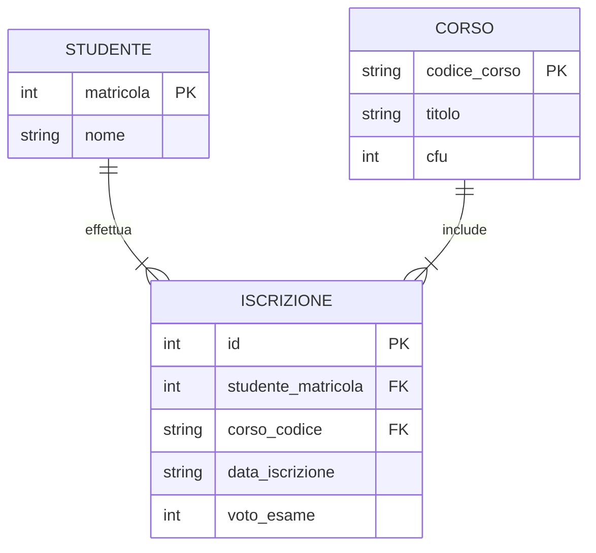

# Design Esercizio 03: Studenti e Corsi (N:N)

```mermaid
erDiagram
    STUDENTE ||--|{ ISCRIZIONE : effettua
    CORSO ||--|{ ISCRIZIONE : include

    STUDENTE {
        int matricola PK
        string nome
    }
    ISCRIZIONE {
        int id PK
        int studente_matricola FK
        string corso_codice FK
        string data_iscrizione
        int voto_esame
    }
    CORSO {
        string codice_corso PK
        string titolo
        int cfu
    }
```
