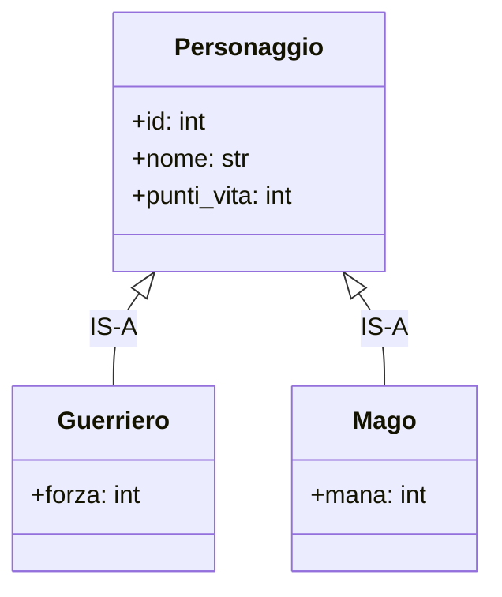

# Design Esercizio 04: Ereditarietà IS-A

```mermaid
classDiagram
    Personaggio <|-- Guerriero : IS-A
    Personaggio <|-- Mago : IS-A

    class Personaggio {
        +id: int
        +nome: str
        +punti_vita: int
    }

    class Guerriero {
        +forza: int
    }

    class Mago {
        +mana: int
    }
```
