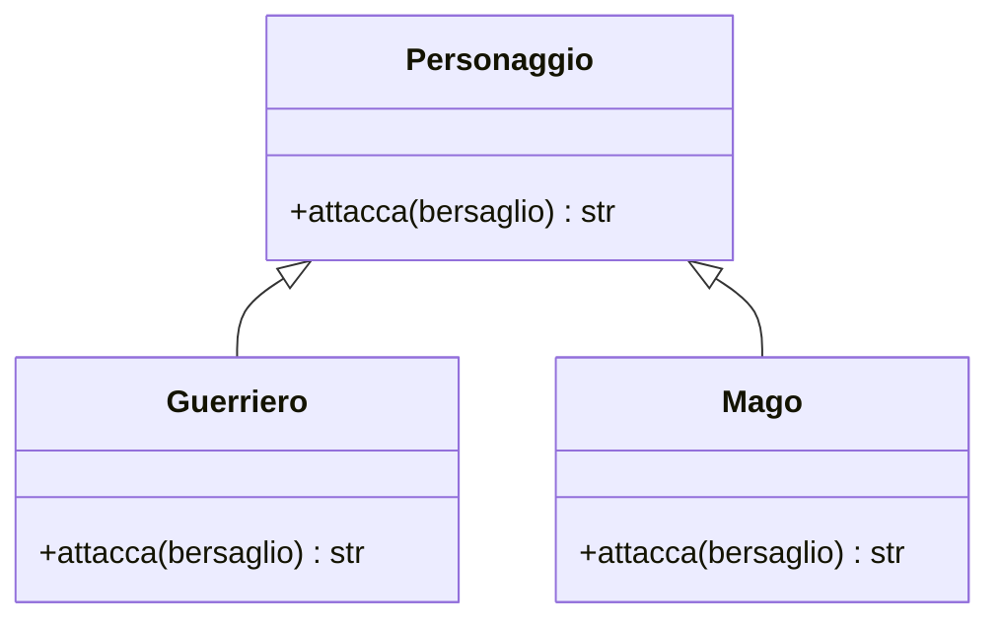

# Design Esercizio 05 (Soluzione di Riferimento)

```mermaid
classDiagram
    Personaggio <|-- Guerriero
    Personaggio <|-- Mago

    class Personaggio {
        +attacca(bersaglio) str
    }
    class Guerriero {
        +attacca(bersaglio) str
    }
    class Mago {
        +attacca(bersaglio) str
    }
```
