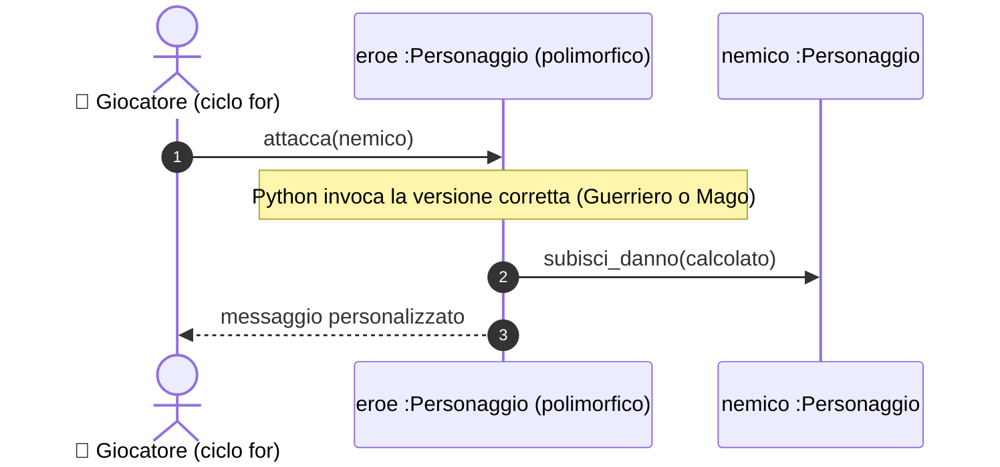

# Design Esercizio 05: Polimorfismo Dinamico

```mermaid
sequenceDiagram
    autonumber
    actor Giocatore as 👤 Giocatore (ciclo for)
    participant Eroe as eroe :Personaggio (polimorfico)
    participant Bersaglio as nemico :Personaggio

    Giocatore->>Eroe: attacca(nemico)
    Note over Eroe: Python invoca la versione corretta (Guerriero o Mago)
    Eroe->>Bersaglio: subisci_danno(calcolato)
    Eroe-->>Giocatore: messaggio personalizzato
```
