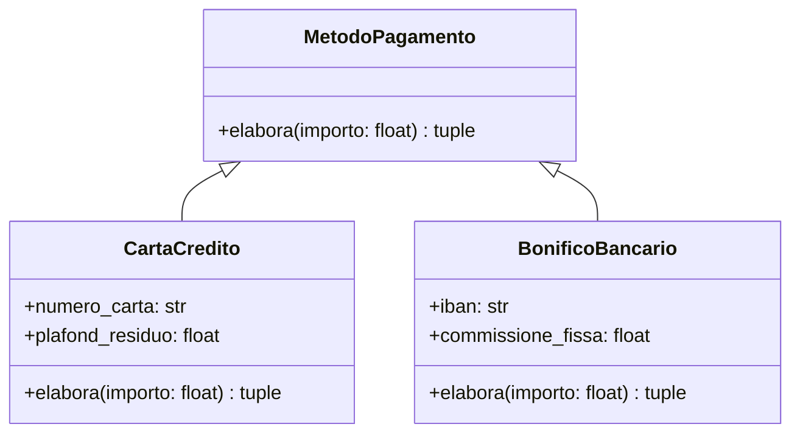

# Design Esercizio 06 (Soluzione di Riferimento)

```mermaid
classDiagram
    MetodoPagamento <|-- CartaCredito
    MetodoPagamento <|-- BonificoBancario

    class MetodoPagamento {
        +elabora(importo: float) tuple
    }

    class CartaCredito {
        +numero_carta: str
        +plafond_residuo: float
        +elabora(importo: float) tuple
    }

    class BonificoBancario {
        +iban: str
        +commissione_fissa: float
        +elabora(importo: float) tuple
    }
```
