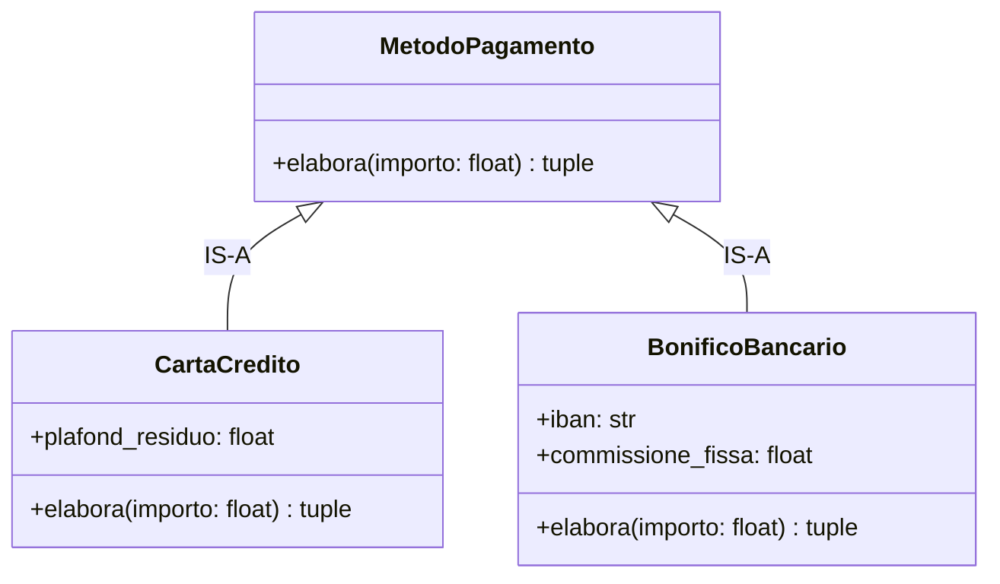

# Design Esercizio 06: Metodi di Pagamento

```mermaid
classDiagram
    MetodoPagamento <|-- CartaCredito : IS-A
    MetodoPagamento <|-- BonificoBancario : IS-A

    class MetodoPagamento {
        +elabora(importo: float) tuple
    }
    class CartaCredito {
        +plafond_residuo: float
        +elabora(importo: float) tuple
    }
    class BonificoBancario {
        +iban: str
        +commissione_fissa: float
        +elabora(importo: float) tuple
    }
```
