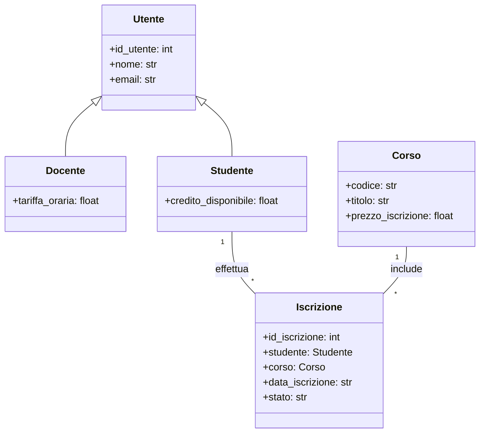

# Design Esercizio 07 (Soluzione di Riferimento)

```mermaid
classDiagram
    Utente <|-- Docente
    Utente <|-- Studente
    Studente "1" -- "*" Iscrizione : effettua
    Corso "1" -- "*" Iscrizione : include

    class Utente {
        +id_utente: int
        +nome: str
        +email: str
    }
    class Docente {
        +tariffa_oraria: float
    }
    class Studente {
        +credito_disponibile: float
    }
    class Corso {
        +codice: str
        +titolo: str
        +prezzo_iscrizione: float
    }
    class Iscrizione {
        +id_iscrizione: int
        +studente: Studente
        +corso: Corso
        +data_iscrizione: str
        +stato: str
    }
```
