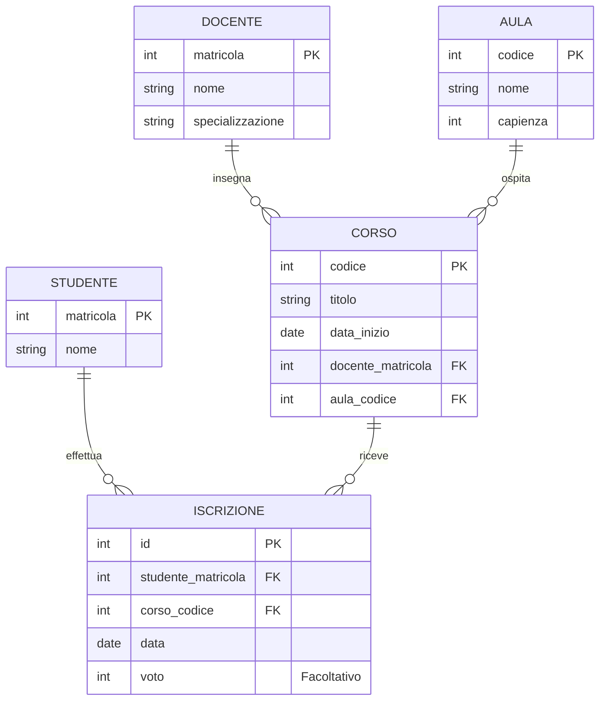
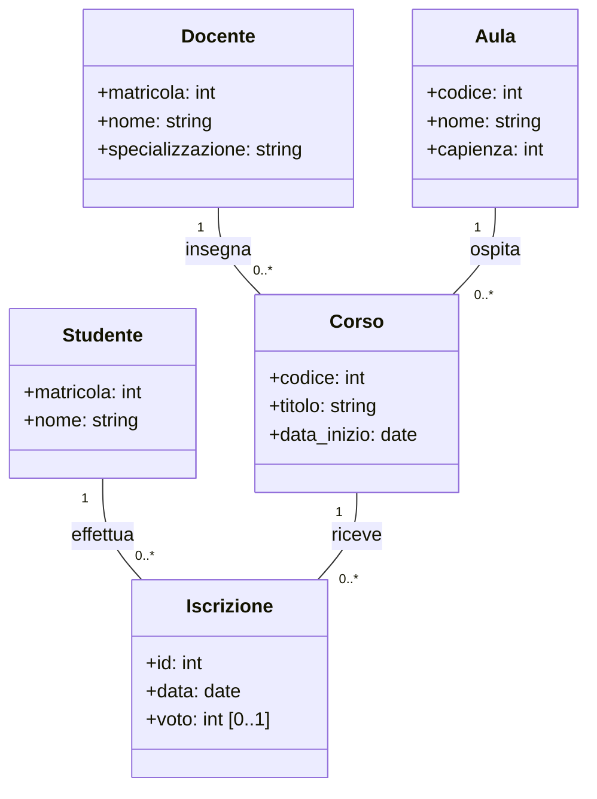

# Esercizio 03: Soluzione di riferimento

```mermaid
erDiagram
    DOCENTE ||--o{ CORSO : insegna
    AULA ||--o{ CORSO : ospita
    STUDENTE ||--o{ ISCRIZIONE : effettua
    CORSO ||--o{ ISCRIZIONE : riceve
    DOCENTE {
        int matricola PK
        string nome
        string specializzazione
    }
    AULA {
        int codice PK
        string nome
        int capienza
    }
    CORSO {
        int codice PK
        string titolo
        date data_inizio
        int docente_matricola FK
        int aula_codice FK
    }
    STUDENTE {
        int matricola PK
        string nome
    }
    ISCRIZIONE {
        int id PK
        int studente_matricola FK
        int corso_codice FK
        date data
        int voto "Facoltativo"
    }
```

```mermaid
classDiagram
    Docente "1" -- "0..*" Corso : insegna
    Aula "1" -- "0..*" Corso : ospita
    Studente "1" -- "0..*" Iscrizione : effettua
    Corso "1" -- "0..*" Iscrizione : riceve
    class Docente {
        +matricola: int
        +nome: string
        +specializzazione: string
    }
    class Aula {
        +codice: int
        +nome: string
        +capienza: int
    }
    class Corso {
        +codice: int
        +titolo: string
        +data_inizio: date
    }
    class Studente {
        +matricola: int
        +nome: string
    }
    class Iscrizione {
        +id: int
        +data: date
        +voto: int [0..1]
    }
```

- La coppia studente-corso è univoca; il voto è facoltativo e riguarda una specifica iscrizione.
