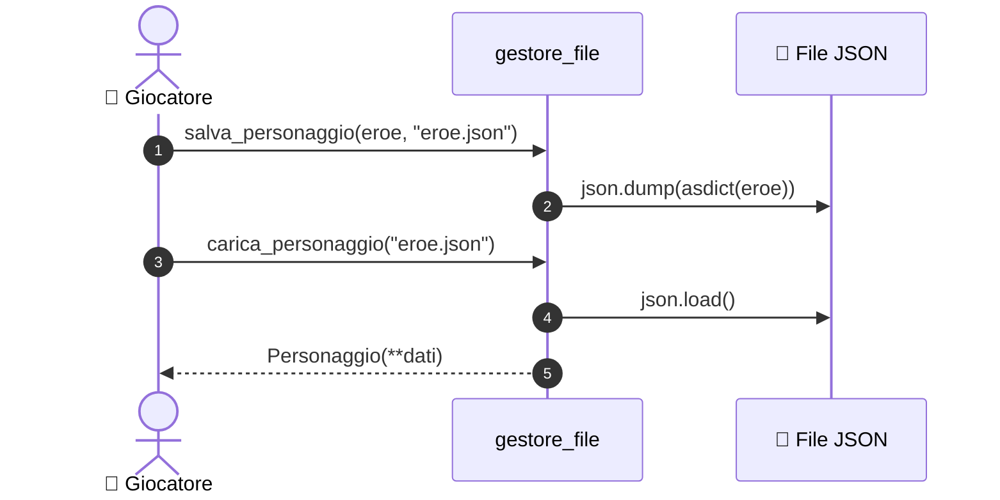

# Design Esercizio 01 (Soluzione di Riferimento)

```mermaid
sequenceDiagram
    autonumber
    actor Giocatore as 👤 Giocatore
    participant Modulo as gestore_file
    participant File as 💾 File JSON

    Giocatore->>Modulo: salva_personaggio(eroe, "eroe.json")
    Modulo->>File: json.dump(asdict(eroe))
    Giocatore->>Modulo: carica_personaggio("eroe.json")
    Modulo->>File: json.load()
    Modulo-->>Giocatore: Personaggio(**dati)
```
