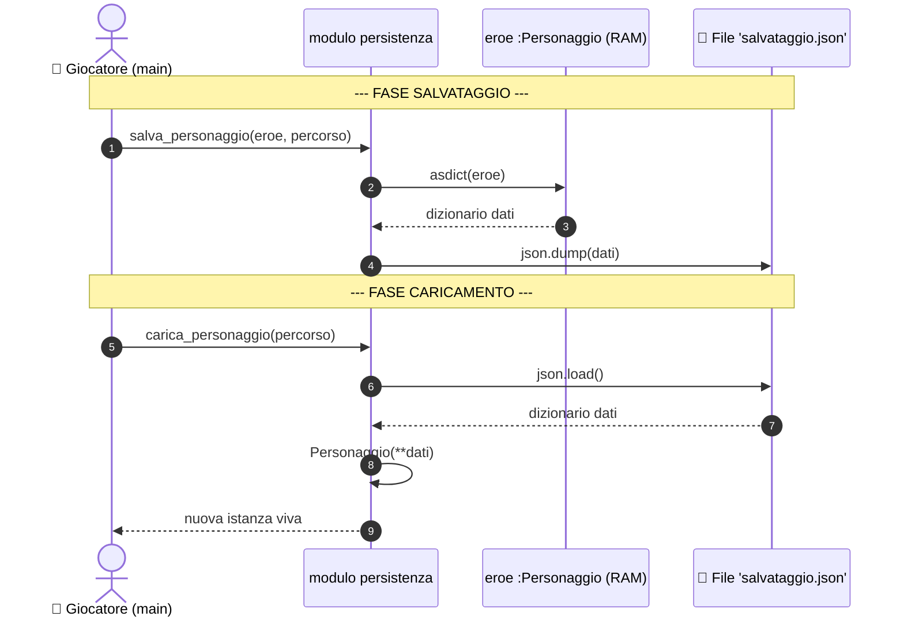

# Design Esercizio 01: Persistenza Base

## Diagramma di Sequenza (Salvataggio e Ricaricamento)

```mermaid
sequenceDiagram
    autonumber
    actor Giocatore as 👤 Giocatore (main)
    participant Gestore as modulo persistenza
    participant Eroe as eroe :Personaggio (RAM)
    participant Disco as 💾 File 'salvataggio.json'

    Note over Giocatore,Disco: --- FASE SALVATAGGIO ---
    Giocatore->>Gestore: salva_personaggio(eroe, percorso)
    Gestore->>Eroe: asdict(eroe)
    Eroe-->>Gestore: dizionario dati
    Gestore->>Disco: json.dump(dati)

    Note over Giocatore,Disco: --- FASE CARICAMENTO ---
    Giocatore->>Gestore: carica_personaggio(percorso)
    Gestore->>Disco: json.load()
    Disco-->>Gestore: dizionario dati
    Gestore->>Gestore: Personaggio(**dati)
    Gestore-->>Giocatore: nuova istanza viva
```
