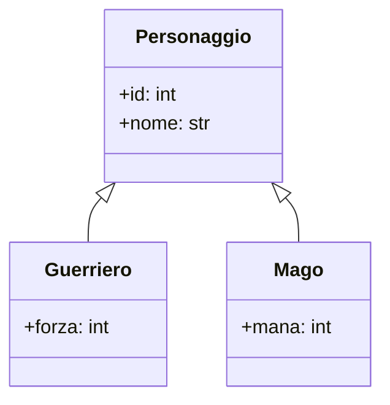

# Design Esercizio 03: Polimorfismo su Disco



### Struttura JSON con Discriminatore:
```json
[
    {"tipo": "guerriero", "id": 1, "nome": "Conan", "forza": 12},
    {"tipo": "mago", "id": 2, "nome": "Merlino", "mana": 45}
]
```
