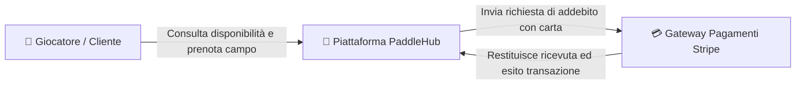

# Design Esercizio 01: C4 Livello 1 — System Context PaddleHub (Soluzione di Riferimento)

```mermaid
flowchart LR
    GIOCATORE[👤 Giocatore / Cliente] -->|Consulta disponibilità e prenota campo| SYSTEM[🎾 Piattaforma PaddleHub]
    SYSTEM -->|Invia richiesta di addebito con carta| STRIPE[💳 Gateway Pagamenti Stripe]
    STRIPE -->|Restituisce ricevuta ed esito transazione| SYSTEM
```