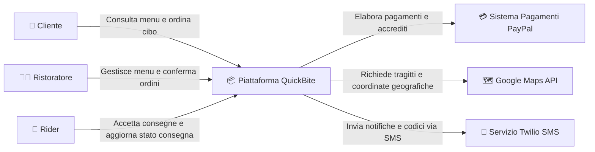

# Design Esercizio 02: C4 Livello 1 — System Context QuickBite (Soluzione di Riferimento)

```mermaid
flowchart LR
    CLIENTE[👤 Cliente] -->|Consulta menu e ordina cibo| QB[📦 Piattaforma QuickBite]
    RISTORANTE[👨‍🍳 Ristoratore] -->|Gestisce menu e conferma ordini| QB
    RIDER[🛵 Rider] -->|Accetta consegne e aggiorna stato consegna| QB

    QB -->|Elabora pagamenti e accrediti| PAYPAL[💳 Sistema Pagamenti PayPal]
    QB -->|Richiede tragitti e coordinate geografiche| MAPS[🗺️ Google Maps API]
    QB -->|Invia notifiche e codici via SMS| SMS[📲 Servizio Twilio SMS]
```