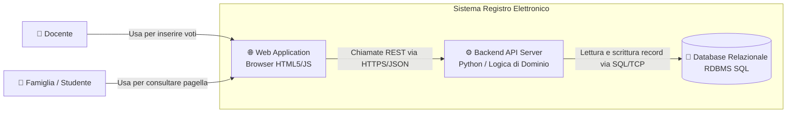

# Design Esercizio 03: C4 Livello 2 — Container Registro Elettronico (Soluzione di Riferimento)

```mermaid
flowchart LR
    DOCENTE[👤 Docente] -->|Usa per inserire voti| WEB
    FAMIGLIA[👤 Famiglia / Studente] -->|Usa per consultare pagella| WEB

    subgraph SYSTEM_BOUNDARY [Sistema Registro Elettronico]
        WEB[🌐 Web Application\nBrowser HTML5/JS] -->|Chiamate REST via HTTPS/JSON| BACKEND[⚙️ Backend API Server\nPython / Logica di Dominio]
        BACKEND -->|Lettura e scrittura record via SQL/TCP| DB[(💾 Database Relazionale\nRDBMS SQL)]
    end
```