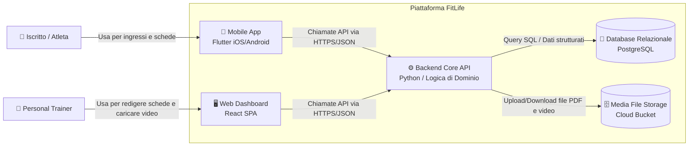

# Design Esercizio 04: C4 Livello 2 — FitLife Multi-Device (Soluzione di Riferimento)

```mermaid
flowchart LR
    ATLETA[👤 Iscritto / Atleta] -->|Usa per ingressi e schede| APP[📱 Mobile App\nFlutter iOS/Android]
    TRAINER[👤 Personal Trainer] -->|Usa per redigere schede e caricare video| WEB[🖥️ Web Dashboard\nReact SPA]

    subgraph FITLIFE_SYSTEM [Piattaforma FitLife]
        APP -->|Chiamate API via HTTPS/JSON| API[⚙️ Backend Core API\nPython / Logica di Dominio]
        WEB -->|Chiamate API via HTTPS/JSON| API

        API -->|Query SQL / Dati strutturati| DB[(💾 Database Relazionale\nPostgreSQL)]
        API -->|Upload/Download file PDF e video| S3[(🗄️ Media File Storage\nCloud Bucket)]
    end
```