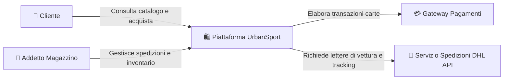
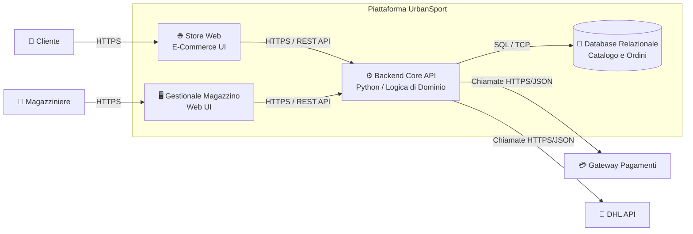

# Design Esercizio 05: Doppio Zoom L1 -> L2 UrbanSport (Soluzione di Riferimento)

## 1. C4 Livello 1: System Context (La Vista Aerea)

---

## 2. C4 Livello 2: Container (Esploso dei Componenti)

