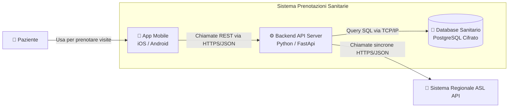

# Design Esercizio 06: Detective Architetturale (Soluzione di Riferimento)

## 1. Il Verdetto del Detective

- **Errore 1 (Errore di Granularità):** Una singola classe (`Classe Prenotazione`) appartiene al **Livello 4 (Code)** del C4 Model. In un diagramma di **Livello 2 (Container)** devono comparire solo blocchi eseguibili separati (App Mobile, Backend API, Database), non singoli costrutti del codice sorgente.
- **Errore 2 (Confine di Sistema):** Il database aziendale risiede sui server della struttura e fa parte del confine interno del sistema. Posizionarlo all'esterno dà la falsa impressione che i dati sanitari risiedano presso fornitori terzi non controllati.
- **Errore 3 (Assenza di Dettagli di Comunicazione):** I collegamenti tra container devono esplicitare i protocolli di trasporto e i formati dati (es. `HTTPS/JSON`, `SQL/TCP`), elementi fondamentali per guidare il team di sviluppo.

---

## 2. Diagramma C4 Container Corretto

