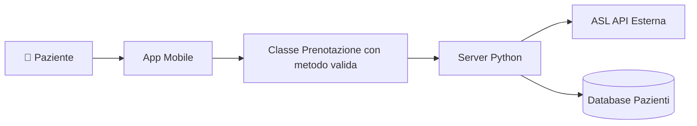

# Design Esercizio 06: Detective Architetturale

## 1. Il Diagramma Difettoso del Collega (Da Analizzare)



---

## 2. Il Verdetto del Detective

- [ ] **Errore 1 (Errore di Granularità / Livello errato):** [...]
- [ ] **Errore 2 (Confine di Sistema / Boundary violato):** [...]
- [ ] **Errore 3 (Assenza di Dettagli di Comunicazione):** [...]

---

## 3. Diagramma C4 Container Corretto

```mermaid
flowchart LR
    %% Ridisegna qui il Container Diagram corretto con boundary, blocchi e protocolli espliciti
```