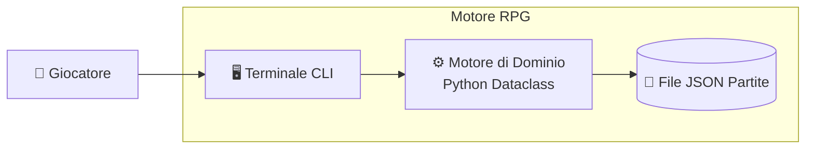
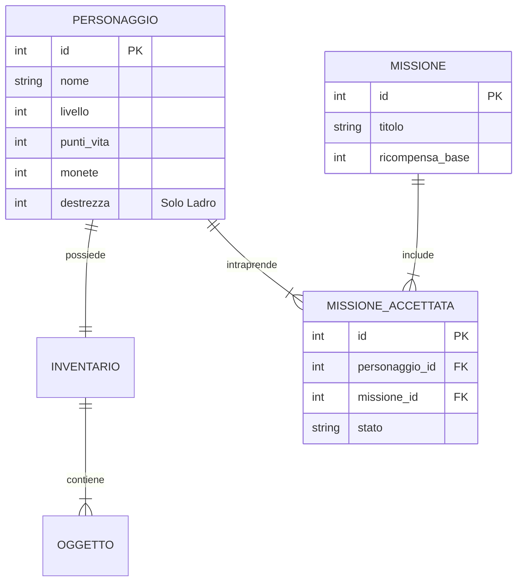
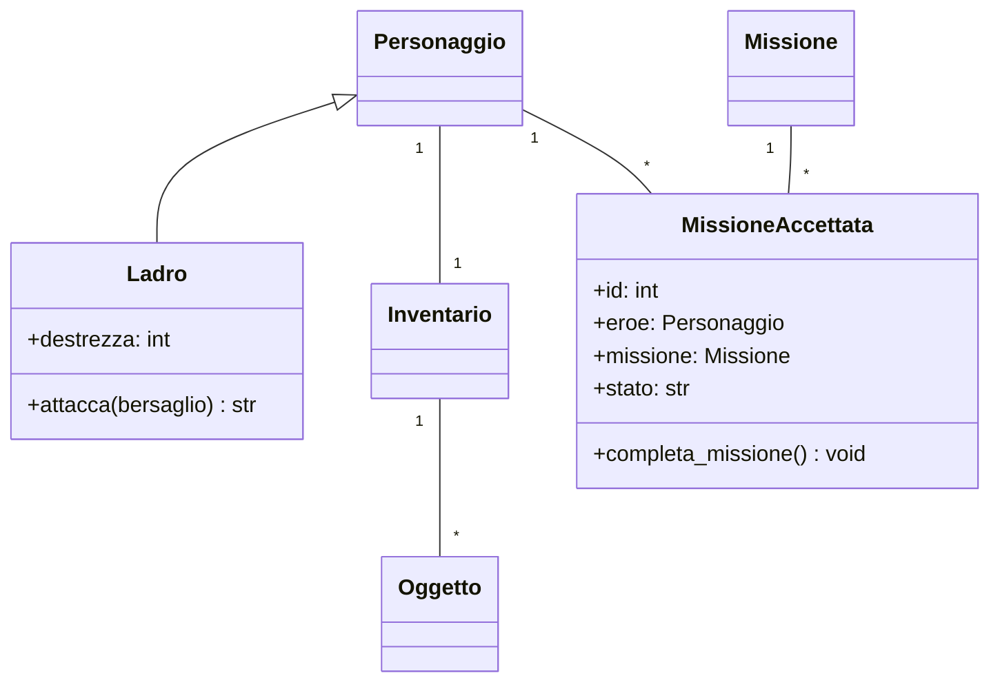

# Design Progetto 01: Espansione RPG (Soluzione di Riferimento)

## 1. C4 Livello 2 (Container)

```mermaid
flowchart LR
    GIOCATORE[👤 Giocatore] --> UI[🖥️ Terminale CLI]
    subgraph RPG_SYSTEM [Motore RPG]
        UI --> CORE[⚙️ Motore di Dominio\nPython Dataclass]
        CORE --> STORAGE[(💾 File JSON Partite)]
    end
```

---

## 2. Modello ER (Database su Disco)

```mermaid
erDiagram
    PERSONAGGIO ||--|| INVENTARIO : possiede
    INVENTARIO ||--|{ OGGETTO : contiene
    PERSONAGGIO ||--|{ MISSIONE_ACCETTATA : intraprende
    MISSIONE ||--|{ MISSIONE_ACCETTATA : include

    PERSONAGGIO {
        int id PK
        string nome
        int livello
        int punti_vita
        int monete
        int destrezza "Solo Ladro"
    }
    MISSIONE_ACCETTATA {
        int id PK
        int personaggio_id FK
        int missione_id FK
        string stato
    }
    MISSIONE {
        int id PK
        string titolo
        int ricompensa_base
    }
```

---

## 3. Class Diagram UML (RAM)

```mermaid
classDiagram
    Personaggio <|-- Ladro
    Personaggio "1" -- "1" Inventario
    Inventario "1" -- "*" Oggetto
    Personaggio "1" -- "*" MissioneAccettata
    Missione "1" -- "*" MissioneAccettata

    class Ladro {
        +destrezza: int
        +attacca(bersaglio) str
    }
    class MissioneAccettata {
        +id: int
        +eroe: Personaggio
        +missione: Missione
        +stato: str
        +completa_missione() void
    }
```