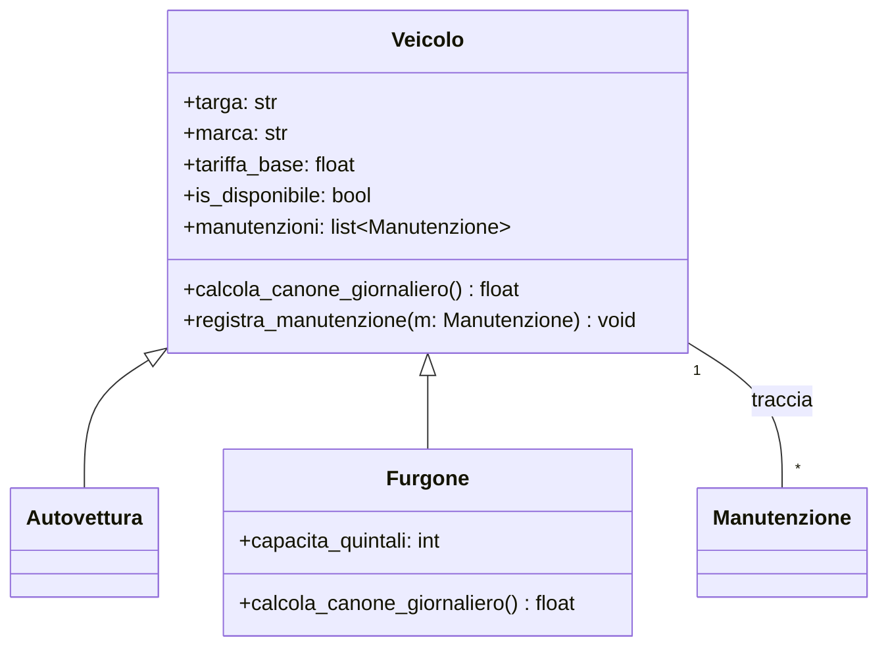

# Design Progetto 03: Flotta Veicoli (Soluzione di Riferimento)

```mermaid
classDiagram
    Veicolo <|-- Autovettura
    Veicolo <|-- Furgone
    Veicolo "1" -- "*" Manutenzione : traccia

    class Veicolo {
        +targa: str
        +marca: str
        +tariffa_base: float
        +is_disponibile: bool
        +manutenzioni: list~Manutenzione~
        +calcola_canone_giornaliero() float
        +registra_manutenzione(m: Manutenzione) void
    }
    class Furgone {
        +capacita_quintali: int
        +calcola_canone_giornaliero() float
    }
```