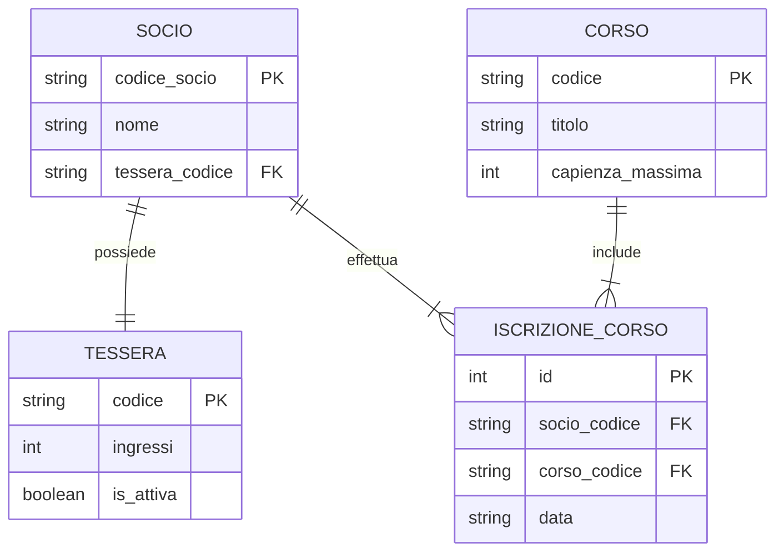

# Design Progetto 04 (Soluzione di Riferimento)

```mermaid
erDiagram
    SOCIO ||--|| TESSERA : possiede
    SOCIO ||--|{ ISCRIZIONE_CORSO : effettua
    CORSO ||--|{ ISCRIZIONE_CORSO : include

    SOCIO {
        string codice_socio PK
        string nome
        string tessera_codice FK
    }
    TESSERA {
        string codice PK
        int ingressi
        boolean is_attiva
    }
    CORSO {
        string codice PK
        string titolo
        int capienza_massima
    }
    ISCRIZIONE_CORSO {
        int id PK
        string socio_codice FK
        string corso_codice FK
        string data
    }
```